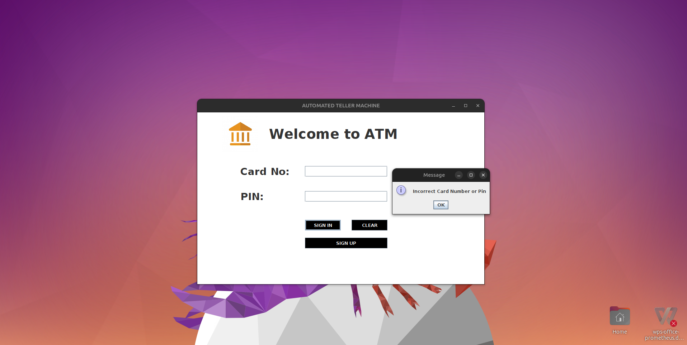
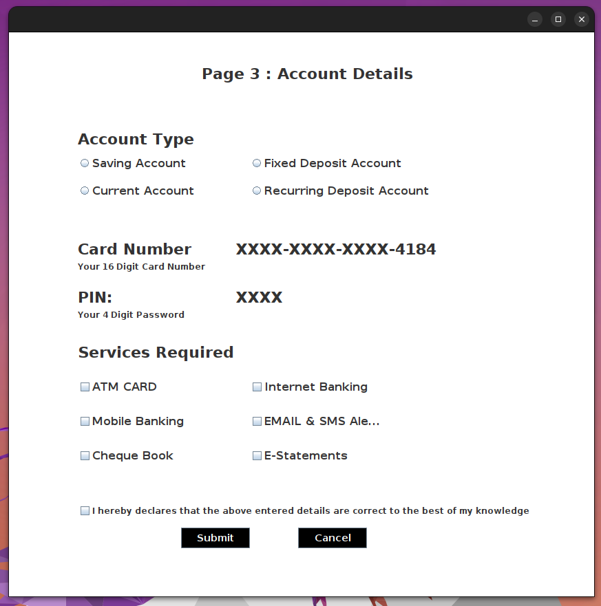
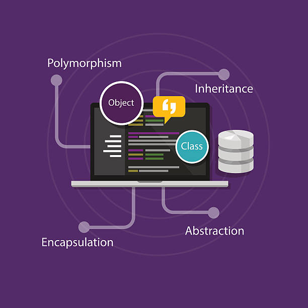

# ATM Management System Project in Java

<!-- Add a catchy logo or banner image here if you have one -->

## Description

The ATM Management System Project in Java is a beginner-friendly desktop application designed to enhance object-oriented programming (OOP) features in Java. It provides a hands-on opportunity to understand Java fundamentals, particularly the application of Swing and AWT to create an interactive and responsive user interface.

## Technologies Used

- **Core Java (Swing & AWT):** Utilized for creating a responsive and interactive GUI.
- **Database Used: MySQL:** Integrated for secure and efficient data storage.
- **IDE used: Netbeans:** Developed and maintained using the Netbeans IDE for Java development.

## Features

- **User Authentication:** Secure login system for authorized access.
- **Account Balance Inquiry:** Check account balance with a single click.
- **Cash Withdrawal:** Perform quick and secure cash withdrawals.
- **Cash Deposit:** Deposit your amount.
- **Transaction History:** View a detailed history of transactions.

## Installation

1. Clone the repository.
2. Open the project in Netbeans.
3. Set up the MySQL database with the provided script.
4. Build and run the project.

## Usage

1. Launch the application.
2. Log in with your credentials.
3. Explore the various features of the ATM Management System.

## Learning Objectives

This project serves as an excellent resource for beginners to:

- Understand and implement OOP principles in Java.
- Gain hands-on experience with Swing and AWT for desktop application development.
- Reinforce Java fundamentals through practical application.

## Contact

For any inquiries or feedback, feel free to contact us at [akashkumar355231@gmail.com](mailto:akashkumar355231@gmail.com).

<!-- Add any additional sections if necessary -->

